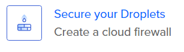
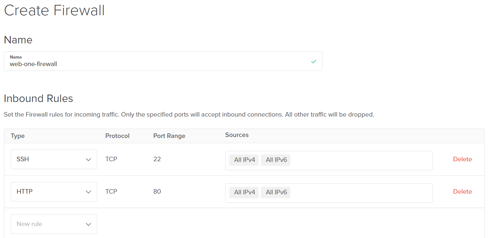

# ACIT 2420 - Week 12 Lab 
## Morteza Rahimi & Christina Yin
This lab utilizes one Ubuntu 20.10 Server hosted on DigitalOcean's San Francisco Servers.

### Step 1: Installing NGINX on Web-One Server
    sudo apt install nginx
    
### Step 2: Create an index.html
Create a directory for your server html files in the /var/www/ directory

    sudo mkdir /var/www/146.190.40.161/html/

Create an index.html file inside this new directory

    sudo vi /var/www/146.190.40.161/html/index.html
    
Add the following base code to index.html
    
    <!DOCTYPE html>
    <html lang="en">
    <head>
        <meta charset="UTF-8">
        <meta http-equiv="X-UA-Compatible" content="IE=edge">
        <meta name="viewport" content="width=device-width, initial-scale=1.0">
        <title>Lab-Week-12</title>
    </head>
    <body>
        <h1>Welcome to the Homepage</h1>
    </body>
    </html>

### Step 3: Creating a Server Block
Create the server block file inside the /etc/nginx/sites-available directory

    sudo vi /etc/nginx/sites-available/146.190.40.161

Add the following to the server block.

    server {
        listen 80;
        listen [::]:80;

        root /var/www/146.190.40.161/html;
        index index.html;

        server_name 146.190.40.161;

        location / {
                try_files $uri $uri/ =404;
        }
    }

### Step 4: Upload File to Server
Create soft link to new server block in sites-enabled

    sudo ln -s /etc/nginx/sites-available/146.190.40.161 /etc/nginx/sites-enabled/
    
Then test that this was successful

    sudo nginx -t
    

### Step 5: Restart NGINX

    systemctl restart nginx
    

### Step 6: Check if index.html Being Served

### Step 7: Create a Firewall
Navigate to the DigitalOcean control panel and select the Secure your droplet option

Then add both an HTTP and SSH Inbound Rule from the dropdown menu

Apply this firewall to the web-one server

Lastly click complete and you should see a firewall now existing

### Step 8: Test Access After Firewall

